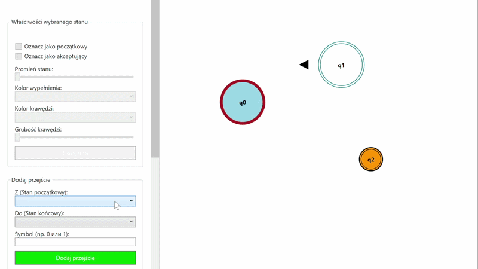
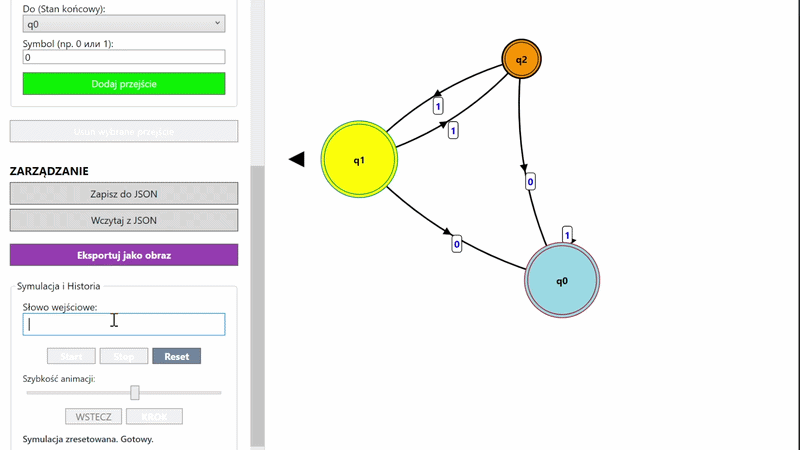
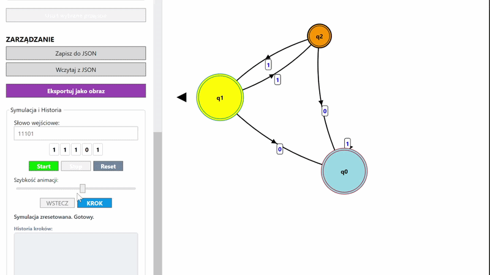
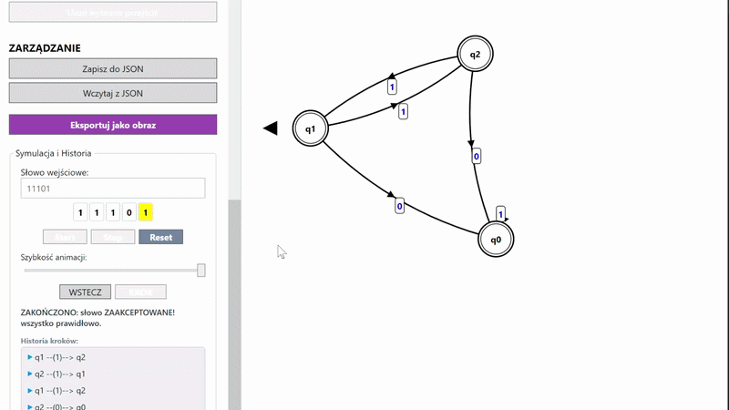
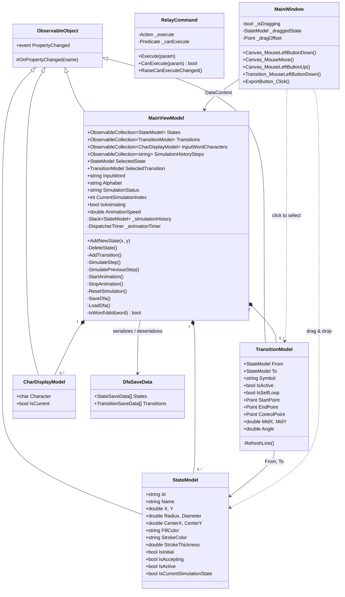

# DFA Designer & Simulator

DFA Designer & Simulator is a WPF desktop application that allows users to visually design deterministic finite automata and simulate their computation on input words, with both step-by-step and animated modes.

The application was created as a part of the Programming in Graphic Enviroment course at Warsaw University of Technology (WUT) during the 4th semester of Computer Science bachelor studies(2026).

## Main idea

The main idea of the application is to provide an interactive canvas-based environment for building and running deterministic finite automata. Users can draw states directly on the canvas, connect them with labeled transitions, customize the visual appearance of each element, and then load an input word to watch the automaton process it in real time.

The interface is split into two views — **Lab** (the editor) and **Home** (the simulator) — so the design and the execution concerns stay clearly separated.

## Example of usage


## Technical features

**1. Interactive canvas editor.**
States are added by double-clicking anywhere on the canvas and can be freely repositioned by dragging. Each state is automatically labelled $q_0, q_1, \ldots, q_n$. A single click activates a state, highlighting it visually; clicking empty canvas space deactivates it. Any state can be marked as initial or accepting via checkboxes — marking a new initial state automatically unmarks the previous one. Accepting states are rendered with a double circle.

**2. Customisable state appearance** via Data Binding.
Each state exposes four visual properties that can be edited through dedicated controls while the state is active: fill colour, border colour, radius, and border thickness. All changes reflect on the canvas instantly through WPF bindings.

**3. Transition management.**
Transitions are added through a form with two dropdowns and a symbol field. Labels follow the format `a,b,c` where each symbol is a single character from the alphabet Σ. Regular transitions are rendered as quadratic Bézier curves with an arrowhead; self-loops use an arc segment. Bidirectional transitions between the same pair of states are offset so they never overlap. Transitions can be activated by clicking their label and deleted via a dedicated button. The current alphabet Σ is derived dynamically from all transition labels and displayed in the UI.

**4. Import and export.**
Automata can be saved to and loaded from JSON files. The file picker opens in the `Samples` folder by default. Imported files are validated — missing fields, broken state references, or malformed JSON all produce descriptive error messages. The canvas can also be exported as an image.

**5. Input word validation and simulation.**
Before simulation starts, the input word is checked against the current alphabet Σ; any invalid symbol triggers a warning. During simulation, the currently processed character is highlighted in the word display. The input field is locked while a simulation is running.

**6. Step-by-step mode.**
The `KROK` and `WSTECZ` buttons advance or revert the automaton one step at a time. The active state and transition are highlighted on the canvas at each step. Buttons are automatically disabled when there is nowhere to go (first or last symbol). After the last step, the UI reports whether the word was accepted or rejected.

**7. Animation mode.**
`Start`, `Stop`, and `Reset` control automatic playback. Animation speed is adjustable via a slider (200–2000 ms per step). All buttons update their enabled state based on context — before loading an automaton everything is disabled, during animation only `Stop` is available, and so on.

**8. Computation history.**
A list below the controls records every step as a *(state, symbol)* pair. `KROK` appends an entry; `WSTECZ` removes the last one. Loading a new automaton or changing the input word resets the list.

## Interactive features

| 1. Adding and dragging states | 2. Customising state appearance |
| :--: | :--: |
|  |  |
| 3. Adding transitions and self-loops | 4. Step-by-step simulation |
|  |  |
| 5. Animation mode with speed control | 6. Import and export |
|  |  |

## Architecture

The application follows the **MVVM** pattern. All state is held in `MainViewModel`; the XAML views bind to it directly. The code-behind in `MainWindow` handles only low-level mouse events for drag-and-drop and transition clicking — everything else goes through commands and bindings.



States and transitions are rendered through two separate `ItemsControl` layers over a shared `Canvas`. State appearance is driven entirely by `DataTemplate.Triggers` — accepting states get a double ellipse, the active state changes border colour, and the current simulation state gets its own highlight. Transitions use `QuadraticBezierSegment` for regular arrows and `ArcSegment` for self-loops, with a `Polygon` arrowhead positioned via `RenderTransform`.

Simulation state is tracked with a `Stack<StateModel>`. Each forward step pushes the previous state onto the stack and appends a record to `SimulationHistorySteps`; each backward step pops the stack and removes the last record. Animation runs the same `SimulateStep()` on every tick of a `DispatcherTimer` whose interval is bound to the speed slider.

## JSON format

```json
{
  "States": [
    { "Id": "guid", "Name": "q0", "X": 100, "Y": 200, "IsInitial": true,  "IsAccepting": false },
    { "Id": "guid", "Name": "q1", "X": 300, "Y": 200, "IsInitial": false, "IsAccepting": true  }
  ],
  "Transitions": [
    { "FromId": "guid-q0", "ToId": "guid-q1", "Symbol": "0,1" },
    { "FromId": "guid-q1", "ToId": "guid-q1", "Symbol": "0"   }
  ]
}
```

## Requirements
The application is built using WPF on .NET 9 (Windows only). 
